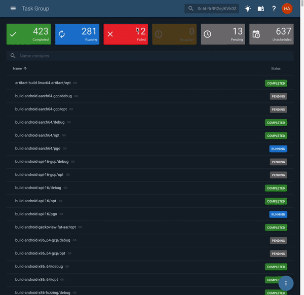

# Taskcluster UI

This repository contains a collection of useful tools for use with Taskcluster.
Generally, we strive to not add UI to Taskcluster components, but instead offer
well documented APIs that can be easily consumed using a client library for
Taskcluster.

## Web Server

The taskcluster-ui application relies on a server application in order to
perform queries to the Taskcluster APIs. That package is
[web-server](../services/web-server).
**Follow the instructions** for starting it prior to launching
the web UI. You will need to launch web-server in a terminal
instance separate from the UI in order to run both simultaneously.

For development, the web-server process must be serving on
http://localhost:3050, but otherwise need not be publicly accessible. The
development server for this repo will proxy requests as necessary to
http://localhost:3050.

## Environment

To get started local development, just:

* ensure web-server is running as suggested above
* change to the `ui/` directory
* install the dependencies with `yarn`
* start the UI server with `yarn start`

You can customize the settings if you'd like, but this is not required for most development.
Create a file in the `ui/` directory named `.env` with the following content:

```bash
APPLICATION_NAME="Taskcluster"
```

_Note: The `APPLICATION_NAME` can be whatever you wish it to be._

You can optionally specify the port on which the development server serves with

```bash
PORT=9000
```

If you are not running the web service on your local machine, you will also need to set

```bash
GRAPHQL_SUBSCRIPTION_ENDPOINT=wss://mydomain.com/subscription
GRAPHQL_ENDPOINT=https://mydomain.com/graphql
```

### Deployments

If you are only looking to deploy the docs site, configure `DOCS_ONLY` to be `true`.

### Login Strategies

Login strategies are specifed in `UI_LOGIN_STRATEGY_NAMES`, split on space. They are used to identify which
login widget(s) to display to the end user.

Taskcluster supports the following strategies:
* `github` - GitHub
* `mozilla-auth0` - Mozilla Auth0

_Example: Enabling the `github` and `mozilla-auth0` strategies_

```bash
UI_LOGIN_STRATEGY_NAMES="github mozilla-auth0"
```

_Note: Each strategy requires its own set of config in `web-server`. Be sure to reference the
[web-server instructions](https://github.com/taskcluster/taskcluster/tree/master/services/web-server#login-strategies)
for properly configuring the server._

### Tracking Events

Google Analytics can be leveraged to track page views and click events.
Set up Analytics by including a the tracking ID (a string like UA-XXXXXXXX) environment variable.

```bash
GA_TRACKING_ID=XXXXXXXX
```

Once the tracking code is identified, the client will send a page event on each page view.
Moreover, the `Button` component is able to send an event when clicked by setting
the Button's `track` property.

### Reporting Errors

The `SENTRY_DSN` environment variable can be used to set up Sentry to monitor and fix crashes.

## Icons

You can browse a list of available icons at:

https://materialdesignicons.com/

These can be imported into the app by using the Pascal-cased name of the icon from the
[`mdi-react`](https://github.com/levrik/mdi-react) package<sup>*</sup>.
For example, if you would like to use the `book-open-page-variant` icon, you can import it with:

```jsx
import BookOpenPageVariantIcon from 'mdi-react/BookOpenPageVariantIcon';

// ...

<BookOpenPageVariantIcon />
```

<sup>* We use this library because it provides substantially more icons with minimal file-system headaches.</sup>

## Necessary Practices

1. For views showing secret, user-linked data or are using `client.fetchMore` to load more data
on page load, graphql queries of that view must include the `fetchPolicy: 'network-only'` option to ensure
data reflects the user's permissions and is up-to-date when a user logs in/out.

## Table of Contents

<!-- TOC BEGIN -->
* [src/components/DateDistance](src/components/DateDistance#readme)
* [src/components/Search](src/components/Search#readme)
* [src/components/Snackbar](src/components/Snackbar#readme)
* [src/components/SpeedDial](src/components/SpeedDial#readme)
* [src/components/StatusLabel](src/components/StatusLabel#readme)
<!-- TOC END -->
